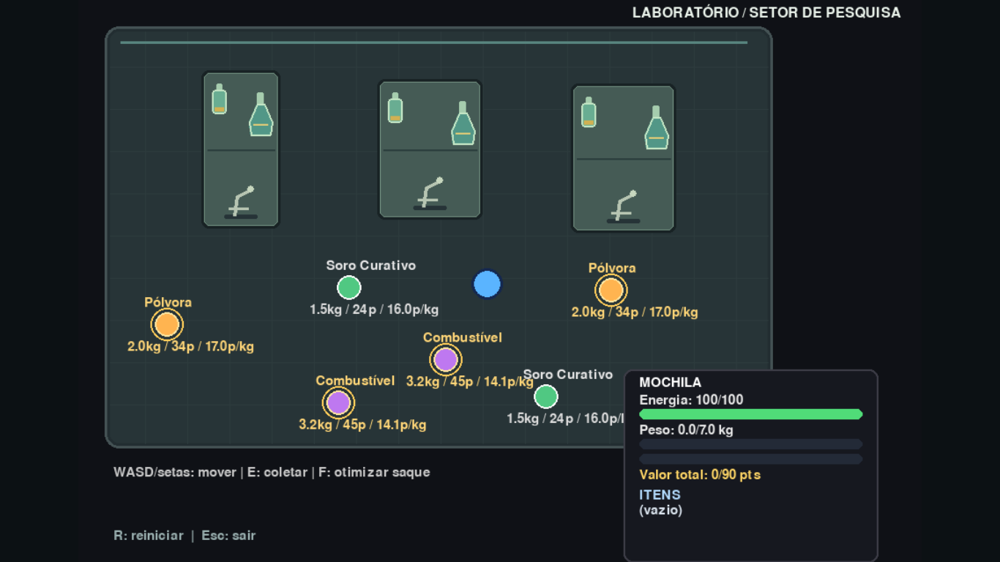

# G41_Greedy_PA-26.2

O projeto base de um jogo de ação/sobrevivência em laboratório, com ambiente de coleta, interface da mochila e itens de substâncias, da disciplina de Projeto de Algoritmos, usando o algoritmo de Knapsack.

## Vídeo

Link do vídeo [aqui](https://youtu.be/jONq1qaucf4).

## Screenshot



## Pontuação e objetivo

Cada item coletado acrescenta seus pontos à pontuação. A mochila mostra o progresso até a meta de 90 pontos; atingir a meta representa vitória. Há mais de uma estratégia viável: dois combustíveis pesam 6,4 kg e valem 90 pontos, enquanto combustível, pólvora e soro pesam 6,7 kg e valem 103 pontos. O jogador perde quando, considerando os itens restantes e o espaço livre na mochila, não existe mais uma combinação capaz de alcançar 90 pontos.

Pressione `E` perto de um item para coletá-lo individualmente; se não houver espaço para a unidade inteira, apenas a fração que couber será adicionada. Pressione `F` perto de qualquer item para executar o algoritmo guloso da mochila fracionária, ordenar o saque pela razão valor/peso e preencher a capacidade de 7 kg. O inventário mostra as quantidades selecionadas e o valor total.

A energia diminui enquanto o jogador se move e se recupera quando ele fica parado. Ao esgotá-la, a velocidade de movimento é reduzida. Itens com valor igual ou superior a 30 pontos recebem um contorno dourado; mensagens de interação aparecem temporariamente na tela.

O jogo também gera efeitos sonoros de coleta, passos e resultado final, além de partículas ao coletar itens, caminhar e vencer ou perder. Os sons são sintetizados pelo Pygame e ficam silenciosos automaticamente quando não há dispositivo de áudio disponível.

## Como o Knapsack aparece no jogo

O jogo transforma a coleta de itens em um problema clássico de mochila, também conhecido como Knapsack. Cada substância espalhada pelo laboratório tem:

- peso: quanto ocupa na mochila;
- valor: quantos pontos ela gera;
- quantidade disponível: o quanto do item ainda pode ser coletado.

A mochila do jogador tem capacidade fixa de 7 kg, e o desafio é decidir quais itens ou frações de itens devem entrar nela para maximizar a pontuação sem ultrapassar o limite.

Formalmente, o problema pode ser entendido como:

- escolher um conjunto de itens;
- respeitar o peso máximo da mochila;
- maximizar o valor total acumulado.

No jogo, isso é representado pela lógica de coleta e pela ação de otimização automática, em que o personagem tenta montar o melhor saque possível dentro do espaço disponível.

### A variação usada: mochila fracionária

O projeto usa a versão fracionária do Knapsack, e não a versão 0/1. Isso significa que um item pode ser coletado parcialmente: se um objeto pesa 2 kg e a mochila tem 1,5 kg livres, o jogador pode levar apenas a fração correspondente a esse espaço restante.

Essa escolha combina bem com a mecânica do jogo, porque a coleta de itens é contínua e o espaço livre pode ser preenchido gradualmente. Em termos práticos, o algoritmo usado ordena os itens pela razão valor/peso e coleta na ordem mais eficiente até preencher a capacidade restante.

A regra de decisão é simples:

- item com maior valor por kg é priorizado;
- o algoritmo continua até não haver mais espaço;
- frações são armazenadas no inventário e somadas ao valor total.

Essa lógica está implementada na função `fractional_knapsack`, em `src/game.py`, e é acionada pela tecla `F`.

## Como executar

1. Crie um ambiente virtual (opcional, mas recomendado):
   ```bash
   python -m venv .venv
   .venv\Scripts\activate
   ```
2. Instale as dependências:
   ```bash
   pip install -r requirements.txt
   ```
3. Execute o jogo:
   ```bash
   python game.py
   ```

O jogo abre em tela cheia. Pressione `R` para reiniciar com novos pontos de spawn para os itens, ou `Esc` para sair.